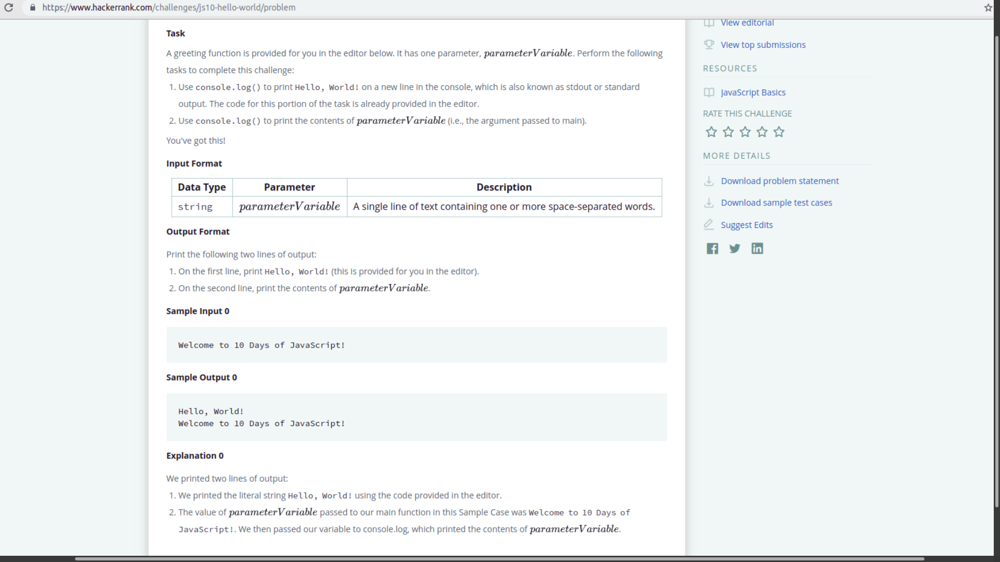
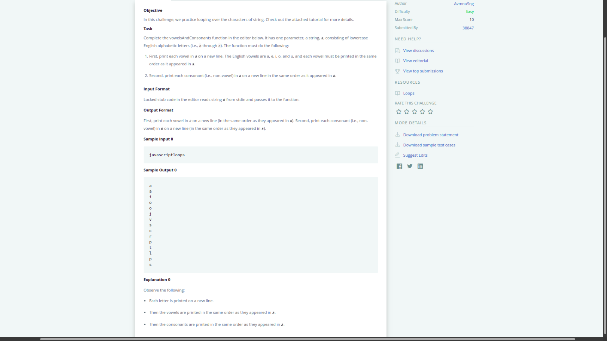
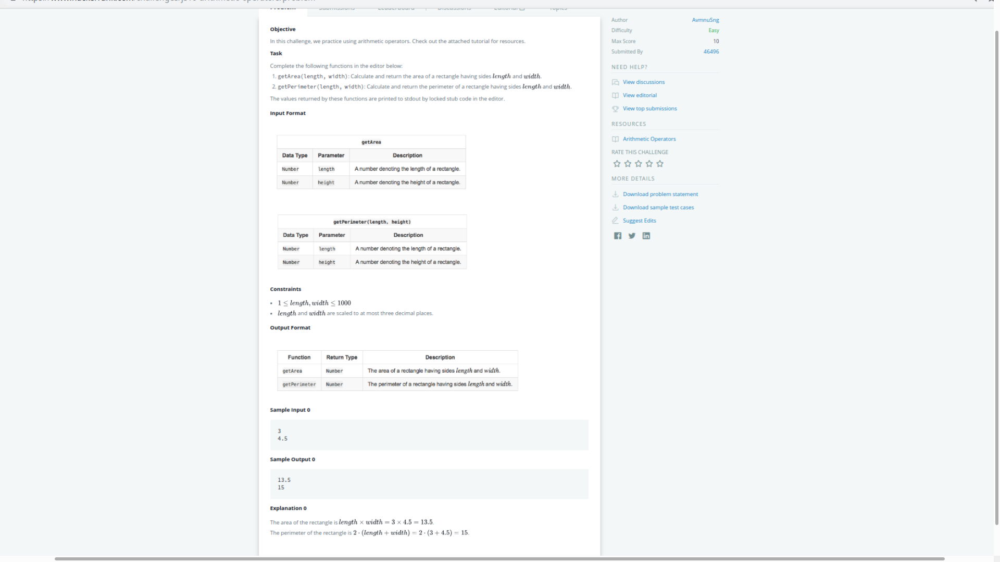
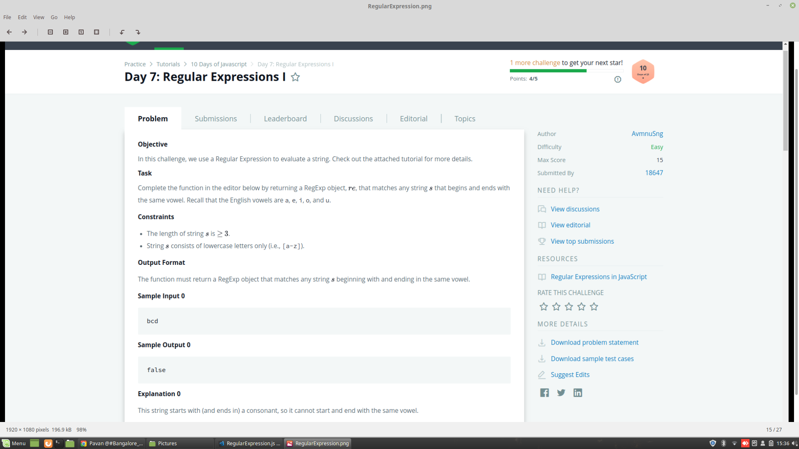
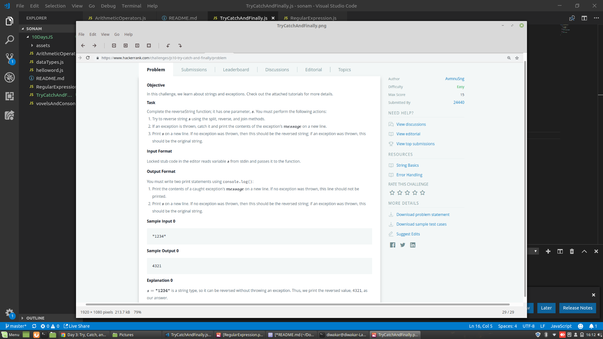

**Js questions**
1. ##Hello word

"https://www.hackerrank.com/challenges/js10-hello-world/problem"

2. ##datatype

https://www.hackerrank.com/challenges/js10-data-types/problem

3. vovelAndConsonet

https://www.hackerrank.com/challenges/js10-loops/problem

4. Arithmetic Operators

https://www.hackerrank.com/challenges/js10-arithmetic-operators/problem

5. Regular Expression

https://www.hackerrank.com/challenges/js10-regexp-1/problem

6. Try, Catch and Finally

https://www.hackerrank.com/challenges/js10-try-catch-and-finally/problem
